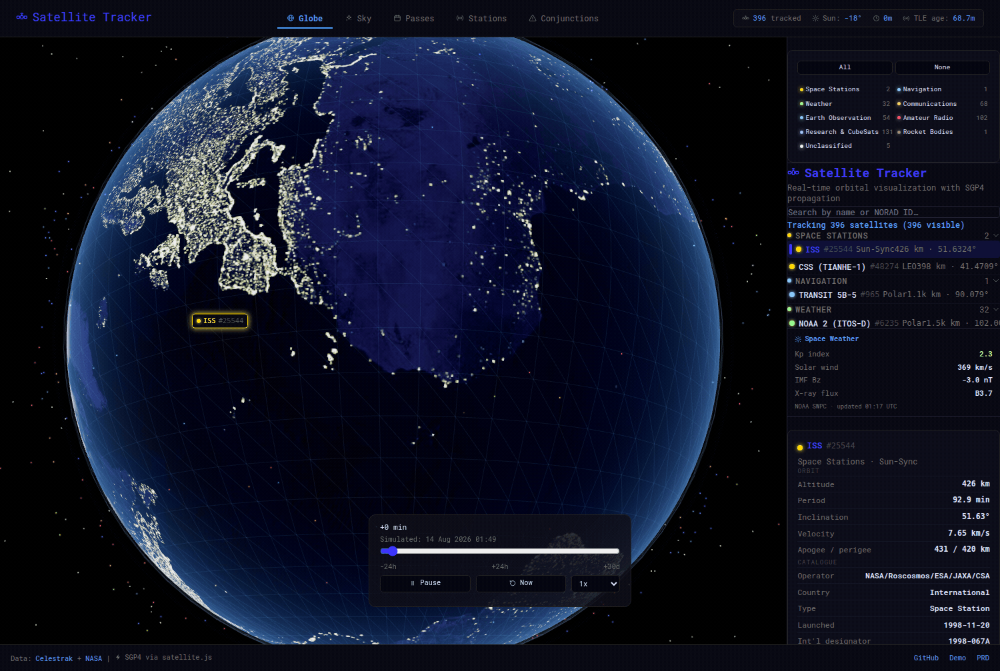

# Satellite Tracker

A real-time, interactive 3D satellite tracking platform for space enthusiasts, amateur astronomers, and educators.

> **Built with:** Next.js 15 (App Router) · Three.js + React Three Fiber · satellite.js (SGP4/SDP4) · Zustand + Immer · Tailwind CSS · SWR
>
> **Live Demo:** `demo/index.html` — a self-contained Canvas 2D prototype with 18 tracked satellites
> **Full Product Spec:** `docs/PRD.md`



---

## Table of Contents

- [Demo](#demo)
- [Quick Start](#quick-start)
- [Project Structure](#project-structure)
- [Validated Accuracy](#validated-accuracy)
- [Satellite Categories](#satellite-categories)
- [Data Sources](#data-sources)
- [Architecture Overview](#architecture-overview)
- [Roadmap](#roadmap)
- [License](#license)

---

## Demo

A working, dependency-free prototype lives in [`demo/index.html`](demo/index.html). Open it in any browser:

```bash
# Simply open in your browser
npx serve demo/     # or any static file server
# or: python3 -m http.server --directory demo
```

The demo renders 18 satellites (ISS, Hubble, Starlink, OneWeb, GPS, GOES, Voyager, etc.) on a 2D canvas projection with:
- SGP4-like orbital propagation with time warping (-24h → +30d)
- Sun-synchronized lighting & terminator line
- Orbit path predictions & ground tracks
- Constellation filtering & satellite search
- Detailed metadata panel

The full PRD with the Next.js + Three.js architecture is in [`docs/PRD.md`](docs/PRD.md).

---

## Quick Start

```bash
# Clone & install
git clone https://github.com/iconbaypark2900/satellite-tracker.git
cd satellite-tracker
pnpm install

# Run locally
pnpm dev
# → http://localhost:3000

# Download NASA Earth textures (first run only; procedural fallback otherwise)
pnpm textures

# Refresh the TLE snapshot (Celestrak, falling back to AMSAT/r4uab mirrors)
pnpm cache:tle

# Run the orbital-math test suite
pnpm test

# Lint + typecheck (next lint && tsc --noEmit)
pnpm lint

# Re-measure accuracy against JPL Horizons (network; writes docs/)
pnpm validate
```

> Run `pnpm build` with the dev server stopped — a production build rewrites
> `.next` underneath a running `pnpm dev` and the dev server starts throwing
> `__webpack_modules__[moduleId] is not a function` until it is restarted.

---

## Project Structure

```
satellite-tracker/
├── app/                          # Next.js 15 App Router
│   ├── api/                      # API Routes
│   │   ├── tle/route.ts          # Proxy → Celestrak TLE API (+ local cache)
│   │   ├── satcat/route.ts       # Proxy → SATCAT metadata API
│   │   ├── passes/route.ts       # Compute pass predictions
│   │   └── spaceweather/route.ts # Proxy → NOAA SWPC
│   ├── (dashboard)/
│   │   ├── globe/page.tsx        # 3D globe view (Three.js)
│   │   ├── sky/page.tsx          # Celestial sphere (alt/az)
│   │   ├── passes/page.tsx       # Pass prediction list
│   │   ├── stations/page.tsx     # Ground-station access planner
│   │   └── conjunctions/page.tsx # Close-approach screener
│   ├── layout.tsx                # Root layout (providers, fonts)
│   ├── page.tsx                  # Landing → redirect to /globe
│   └── globals.css
├── components/
│   ├── globe/                    # Three.js scene components
│   ├── ui/                       # Interactive UI controls (incl. Icon.tsx)
│   ├── stations/                 # Station manager, picker, Gantt timeline
│   └── layout/                   # Header, Footer, Loading
├── lib/                          # Business logic (SGP4, TLE, passes, classify)
├── hooks/                        # Custom React hooks (SWR + Zustand)
├── types/                        # TypeScript interfaces
├── workers/                      # WebWorkers (SGP4 batch, conjunctions)
├── tests/                        # Jest suites for the orbital math
├── public/textures/              # NASA Earth textures
├── public/tle-cache.json         # Build-time TLE snapshot
├── styles/                       # Tailwind + custom CSS
├── scripts/                      # Build/dev utilities
├── demo/index.html               # Standalone working demo
└── docs/                         # PRD, validation methodology + results
```

---

## Validated Accuracy

Predictions are validated against **JPL Horizons** (see
[`docs/VALIDATION.md`](docs/VALIDATION.md) for methodology and
limitations — reproduce with `pnpm validate`):

- Topocentric ISS predictions agree with Horizons to a **median 0.0014°
  all-sky / 0.0013° during passes** over 48h (about 5 arcseconds)
- Slant range agrees to **0.035 km median** (well inside SGP4's 1-3 km
  envelope)
- **11/11 pass culminations** matched within the 1-minute sampling grid
- Documented error growth vs TLE age; per-satellite TLE epoch age is
  surfaced in the UI

**These figures are dominated by TLE age, not by the propagator.** The run
above used an element set about 18 hours old; the same code measured against
an 82-hour-old set gave 0.011°, and a 67-hour-old one 0.039° — a 30× spread
from identical math. Re-run `pnpm validate` after `pnpm cache:tle` rather
than trusting a recorded number.

---

## Satellite Categories

Every object is filed into a **mission category** by
[`lib/classify-satellite.ts`](lib/classify-satellite.ts), which matches on the
catalogue name rather than on the feed the object arrived from.

This decoupling is deliberate. The tracker reads Celestrak when it is
reachable and the amateur-radio mirrors when it is not, and the two carry
completely different catalogues. Categorising by *source* meant that whenever
Celestrak was blocked, every Celestrak-shaped group sat at zero and 98% of the
catalogue landed in "Other". Classifying by name gives the same taxonomy from
either feed, and both the filter panel and the satellite list render only the
categories that actually have members — so a group is never shown at zero.

| Category | Matches |
|---|---|
| Space Stations | ISS, CSS/Tianhe, and visiting vehicles |
| Starlink · OneWeb | The named mega-constellations |
| Navigation | GPS/Navstar, GLONASS, Galileo, BeiDou, Transit |
| Weather | NOAA, MetOp, Meteor, Fengyun, GOES, Elektro-L, Arktika |
| Communications | Inmarsat, Intelsat, SES, Meridian, AIS payloads, military comms |
| Earth Observation | Imaging and remote sensing — Zorkiy, Gaofen, Jilin, PROBA, Sentinel |
| Amateur Radio | OSCAR designators (AO-7, FO-29, QO-100) and the Russian RS series |
| Research & CubeSats | The long tail of university and technology-demonstration smallsats |
| Rocket Bodies | Spent upper stages and catalogued fragments |
| Unclassified | Catalogued, but the name reveals no mission (bare Cosmos serials, launch IDs) |

An amateur designator outranks an opaque serial — `COSMOS-2499 (RS-47)` files
under Amateur Radio, because the suffix says exactly what can be heard from it.
Unmatched names fall to Research & CubeSats rather than Unclassified: that is
what the long tail of both feeds genuinely is, so it is the accurate default
rather than a dumping ground.

---

## Data Sources

| Source | Purpose |
|--------|---------|
| [Celestrak TLE API](https://celestrak.org/) | `gp.php?GROUP=…&FORMAT=tle` — primary live source. Nine feeds (stations, starlink, oneweb, gps-ops, goes, ses, intelsat, weather, amateur), deduplicated by NORAD ID since the feeds overlap |
| [AMSAT](https://www.amsat.org/) + [r4uab](https://r4uab.ru/) | Mirror TLE sources for the build-time cache when Celestrak is unreachable (it blocks some IP ranges) — stations, weather, amateur satellites |
| [Celestrak SATCAT](https://celestrak.org/) | `records.php?CATNR=XXXX&FORMAT=JSON` — metadata enrichment (one CATNR per request), layered over bundled static metadata + TLE-derived launch designators |
| [NASA Visible Earth](https://visibleearth.nasa.gov/) | Blue Marble day map + Earth-at-Night city lights (`pnpm textures`) |

---

## Architecture Overview

```
Browser (R3F + Zustand)
   │
   ├── SWR → Next.js API Routes
   │         ├── /api/tle      → cache file → Celestrak → stale cache → labeled fallback
   │         ├── /api/satcat   → SATCAT proxy (24h cache, graceful absence)
   │         ├── /api/passes   → SGP4 pass predictions (topocentric look angles)
   │         └── /api/spaceweather → NOAA SWPC proxy (5m revalidate)
   │
   ├── WebWorker — batch SGP4 (transferable buffers), main thread
   │              dead-reckons p + v·dt between worker states
   │
   └── Canvas: GlobeScene → Earth (day/night shader, GMST-rotated ECEF frame)
                             + SatelliteLayer (Points shader, screen-space picking,
                               orbit path + ground track for selected/hovered)
                             + SunLighting + Starfield
```

Views: **/globe** (3D scene) · **/sky** (alt/az polar plot for the observer) · **/passes** (rise/set predictions with visibility) · **/stations** (multi-station access planner, Gantt timeline, .ics export) · **/conjunctions** (all-vs-all close-approach screener).

Ops-grade tooling:

- **Conjunction screening** — spatial-hash + linearized-interval-test
  architecture in a dedicated worker; 396 satellites × 24h screened in
  ~0.4s with TCA refined to <0.1s. Scales to full-constellation
  catalogs via chunked ephemeris buffers.
- **Ground-station access planning** — per-station elevation masks,
  station×satellite Gantt timeline, calendar export (RFC 5545).
- **Live NOAA SWPC space weather** — Kp/G-scale, solar wind, IMF Bz,
  GOES X-ray flare class in the sidebar, with LEO-drag storm advisories.

---

## Roadmap

See [`docs/PRD.md`](docs/PRD.md) for the full specification and the
honest per-item checklist. Summary:

- **Phases 1–3 (MVP + views):** 3D globe with real NASA textures, ~400 live satellites (8000-capable), WebWorker SGP4, pass predictions, alt/az sky view, navigation — Yes Done
- **Phase 4:** mobile/responsive audit, OpenGraph/sitemap SEO — partial
- **Phase 5:** Vercel deploy (build pipeline ready), analytics, portfolio page — pending

---

## Contributing

Pull requests welcome! See [`docs/PRD.md`](docs/PRD.md) for full architecture and technical decisions.

---

## License

MIT — see [LICENSE](LICENSE).
